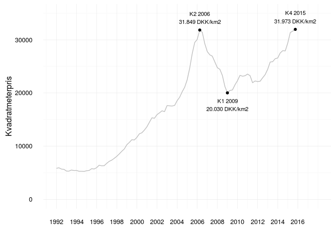

<!-- README.md is generated from README.Rmd. Please edit that file -->
Boligmarkedsstatistikken
========================

Boligmarkedsstatistikken indeholder kvartalsvise oplysninger om de gennemsnitlige kvadratmeterpriser og antallet af frie handler for parcel- og rækkehuse, ejerlejligheder og fritidshuse siden 1992. Tallene er opgjort for landet som helhed, men også for de enkelte regioner, landsdele, kommuner og postnumre. Det er også muligt at hente nøgletal på prisnedslagene på de solgte ejerboliger i perioden fra 2004 og frem.

**Realkreditrådet, Dansk Ejendomsmæglerforening, Realkreditforeningen og Finansrådet står sammen om at udgive Boligmarkedsstatistikken.**

<a rel="license" href="http://creativecommons.org/licenses/by-sa/4.0/"></a><br />This work is licensed under a <a rel="license" href="http://creativecommons.org/licenses/by-sa/4.0/">Creative Commons Attribution-ShareAlike 4.0 International License</a>.

Pakken indeholder: BM010: Ejendomspriser på boligmarkedet efter område, ejendomskategori og priser på realiserede handler BM011: Ejendomspriser på boligmarkedet efter postnr., ejendomskategori og priser på realiserede handler BM020: Bevægelser på boligmarkedet efter område, ejendomskategori og bevægelsestype BM021: Bevægelser på boligmarkedet efter postnr., ejendomskategori og bevægelsestype BM030: Salgstider på boligmarkedet efter område og ejendomskategori BM031: Salgstider på boligmarkedet efter postnr. og ejendomskategori

Sådan gør du:

``` r
# Installer pakken
# devtools::install_github("56north/boligmarkedsstatistikken")

# Load pakken
library(boligmarkedsstatistikken)

# Kald noget boligmarkedsstatistik
data(BM010)

# Kig på ejerlejligheder i København
library(dplyr); library(stringr)

kbh <- BM010 %>% filter(area == "København", category == "Ejerlejlighed", price.type == "Realiseret handelspris")
kbh$new.quarter <- kbh$year + (as.numeric(str_replace_all(kbh$quarter, "K", ""))/4)-.25

# Visualiser data
library(ggplot2)

ggplot(kbh, aes(new.quarter, value)) + 
  geom_line(color = "gray") +
  annotate("text", x = 2006.25, y = 31849, label = "K2 2006\n31.849 DKK/km2", vjust = -0.5, size = 3) +
  annotate("point", x = 2006.25, y = 31849) +
  annotate("text", x = 2009, y = 20030, label = "K1 2009\n20.030 DKK/km2", vjust = 1.5, size = 3) +
  annotate("point", x = 2009, y = 20030) +
    annotate("text", x = 2015.75, y = 31973, label = "K4 2015\n31.973 DKK/km2", vjust = -0.5, size = 3) +
  annotate("point", x = 2015.75, y = 31973) +
  ylim(0,35000) + scale_x_continuous(breaks = seq(1992,2017,2), limits = c(1992,2018)) + 
  theme_minimal() + 
  labs(y  = "Kvadratmeterpris", x = "")
```


